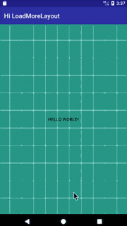

HiLoadMore
===

HiLoadMore是一个通用可扩展的上拉加载控件，实现对任何子View的上拉加载。



# 使用示例
```java
        mLoadMoreLayout.setLoadMoreUIHandler(new LoadMoreUIHandler() {
            @Override
            public void onPrepare() {
                mContent.setText("上拉可以加载");
                mToast.setText(mContent.getText());
                mToast.show();
            }

            @Override
            public void onBegin() {
                mContent.setText("开始加载");
                mToast.setText(mContent.getText());
                mToast.show();
            }

            @Override
            public void onComplete(boolean hasMore) {
                mContent.setText("加载完成");
                mToast.setText(mContent.getText());
                mToast.show();
            }

            @Override
            public void onPositionChange(int offsetY, int offsetToLoadMore) {
                mContent.setText("位移：" + offsetY + "...触发加载需要的位移:" + offsetToLoadMore);
            }
        });

        mLoadMoreLayout.setHasMore(true);
```

# 参考项目

- [《我眼中的下拉刷新》](https://www.liaohuqiu.net/cn/posts/the-pull-to-refresh-in-my-eyes/)
- liaohuqiu/[android-Ultra-Pull-To-Refresh](https://github.com/liaohuqiu/android-Ultra-Pull-To-Refresh)
- nukc/[LoadMoreLayout](https://github.com/nukc/LoadMoreLayout)
